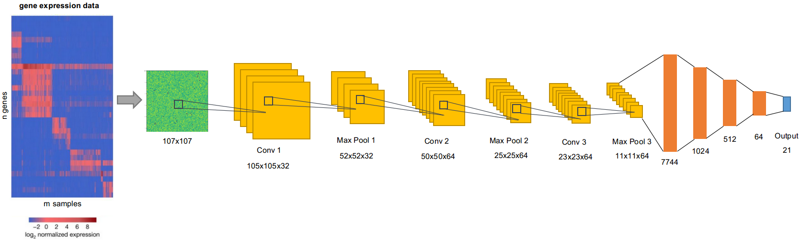

# Interpreting CNN classification of 22 tumor types with Guided Grad-CAM

## Background 

Deep neural networks usually consist of a large number of hidden layers. In machine learning world, interpretation of the results are not usually a concern as long as one can get a robust high performance classifier. However, when machine learning algorithms are applied to medical or Biological field, the interpretation sometimes is more important than making correct prediction itself.

When dealing with biological problems, we need a good classifier but we also need to know why the classifier works. If the expression profile of a bunch of genes were input to a classifier to distinguish the phenotype of interest (eg. disease status or experiment treatment, etc.), biologists are more interested in knowing which genes are driving the observed differences between disease status or different experimental treatments.

In this small project, I built a convolutional neural network (CNN) to distinguish 22 tumor types based on RNA-sequencing data. This classifier has a > 94.04% overall accuracy in blind testing dataset. Since the main purpose here is to interpret the classifier by identifying significant genes that contribute to tumor type classification, I did not spend too much effort on hyperparameter tuning. Rather I put my focus on implementing a technique called **guided grad-CAM** to identify significant genes.

Please refer to their original paper for a detailed description of the Grad-CAM and Guided Grad-CAM techniques:   
[Grad-CAM: Visual Explanations from Deep Networks via Gradient-based Localization](https://arxiv.org/abs/1610.02391)

## Preprocessing data and building the CNN model

A large gene expression (RAN-seq) dataset was downloaded from [TCGA](https://www.cancer.gov/about-nci/organization/ccg/research/structural-genomics/tcga).

The expression profile of single samples was embedded into 2D images, then divide the samples into a training, a validation and a testing dataset. Next a CNN model with three convolutional layers, three max pooling layers and multiple dense layers was built.

## Classifying 22 tumor types

The CNN classifier gives a 94.04% overall accuracy in the blind testing dataset.

And note that the misclassified tumors are of similar in cell types, for example, the misclassification of colon and rectum, and stomach and esophagus. It would be interesting to understand the genes that contribute most in this classifier to see why these these cancer types are more difficult to classify.

## Interpreting the model with Guided Grad-CAM

In order to understand which genes contribute most to the classifier, I implemented the Guided Grad-CAM technique in TensorFlow 2 to identify the significant genes by looking at significant pixels after guided grad-CAM computation.

As you can see in the above figure, significant genes were highlighted, by using a proper threshold, we can easily identify those highlighted pixels in the output image (also see script [CNN_gene_picker](https://github.com/YC3/Deep_Learning_CNN/blob/master/CNN_gene_picker.py)).

## Future work

It would be very interesting to dig deeper into the identified genes, do a literature search on their functions, and see how their expression contribute to the correct classification of multiple tumor types.

